# 3D Sensing & Sensor Fusion Exam 

## How to present:
- MAX 5 minutes / assignment. I'll ask questions after your presentation.
- Second, show me your results: some visual ones, then diagrams. Explain the diagrams briefly in order to facilitate understanding.
- Next, briefly explain your evaluations (datasets, methodology).
- Finally, summarise what were your challenges, what have you done as extras.
    
For the professors questions:
- I'll ask into the algorithms and details of your implementation to verify that it was indeed your work, and you know what you're talking about.
- I'm not accepting excuses like "I don't remember because it did it so long ago". Prepare.

## Homework presentations

# Homework 1 - Stero matching & Point cloud algorithm

What I have `done`:

- Algorithms
  - Naive Stero Matching
  - Dynamic Stereo Matching
  - Point cloud (converting disparities to point cloud)
- Evaluation
  - Took 6 pairs of stereo images friom the 2005 Middlebury Stereo dataset and compared the ground truth to the output of the naive and dynamic approach:
  - Searched for the best value for the following parameters:
    - lambda (from 50 to 400)
    - window size (3, 5, 7)
  - Timed both the naive and dynamic approach
  - Difference images
  - Tables of processing times
  - Found optimal window size and lambda parameter
- Documentation

What I have `not done`:

- Algorithms
  - Comparing my Stereo Matching algorithm to existing implementations (optional)
  - Oriented point cloud & Triangulated surface
- Evaluation
  - Metrics
  - Plots

## The output and best values found

|  Dataset | Lambda | Window size | Naive RT(s) | Dynamic RT(s) |
|:--------:|:------:|:-----------:|:-----------:|:-------------:|
|   Books  |   200  |      5      |      3      |       11      |
|  Pencils |   100  |      3      |      3      |       5       |
|   Toys   |   50   |      3      |      3      |       5       |
|  Basket  |   100  |      3      |      3      |       4       |
| Presents |   100  |      3      |      8      |       4       |
|  Statue  |   100  |      3      |      8      |       11      |

## Visual outcome

The output is arranged as follows: `colored image`,` ground truth` (provided by the dataset), `naive approach` and lastly the `dynamic approach`.

### Books

  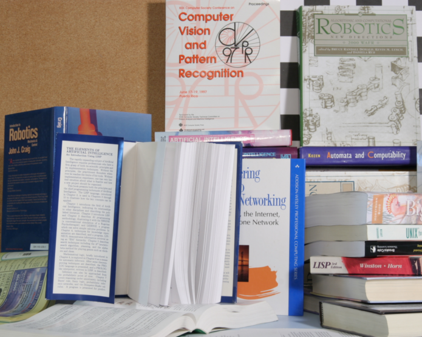
  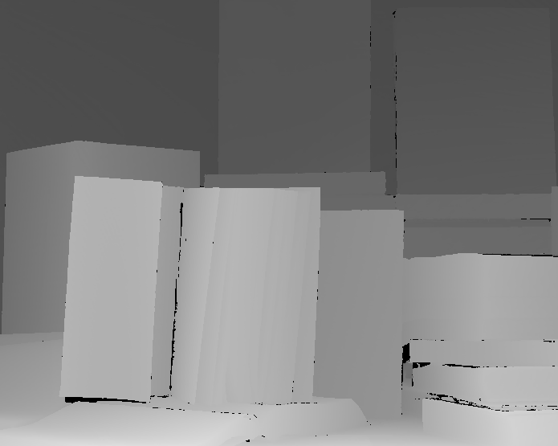 

  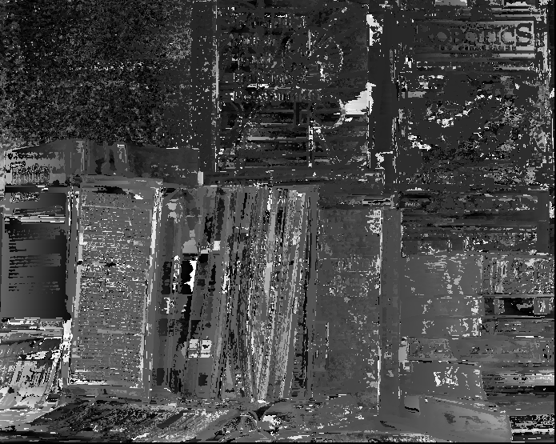
  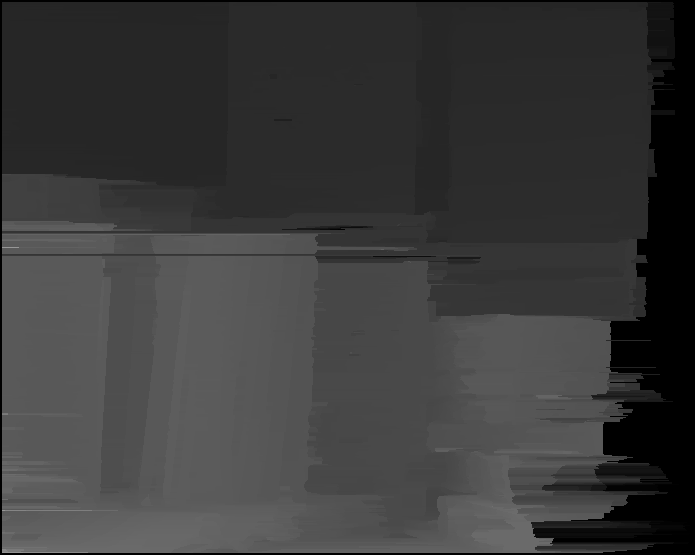

### Pencils

  
   

  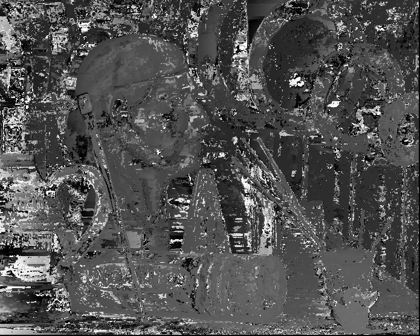
  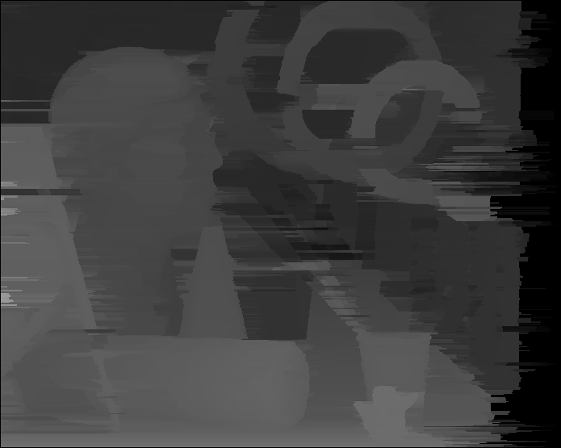

### Toys

  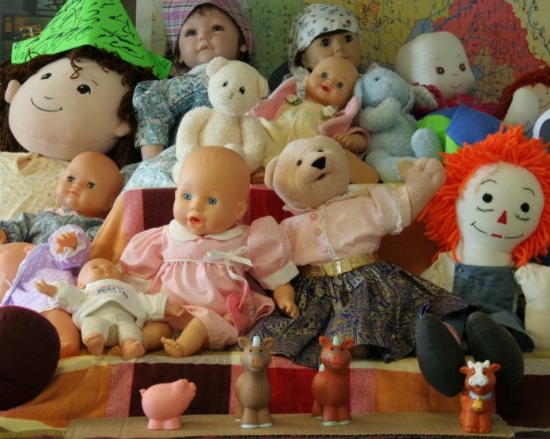
  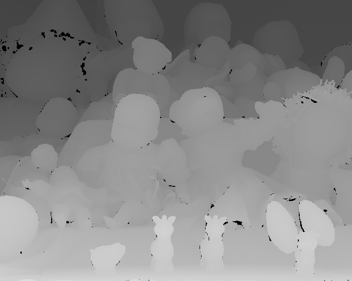 

  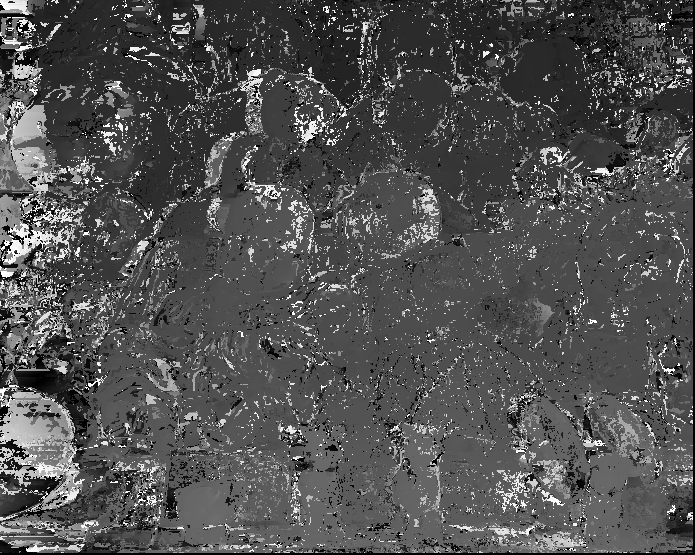
  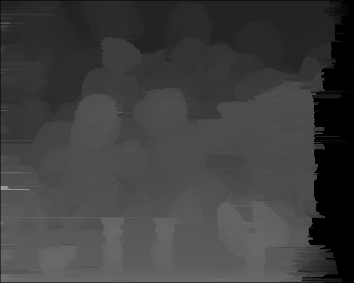

### Basket

  
   

  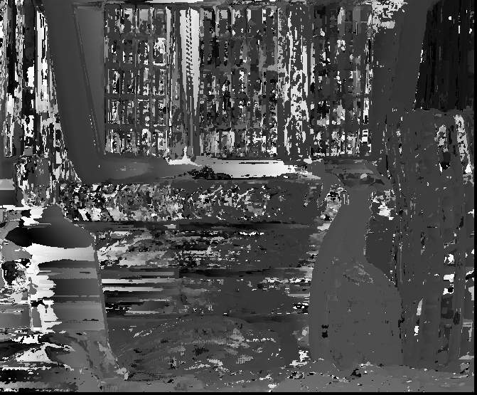
  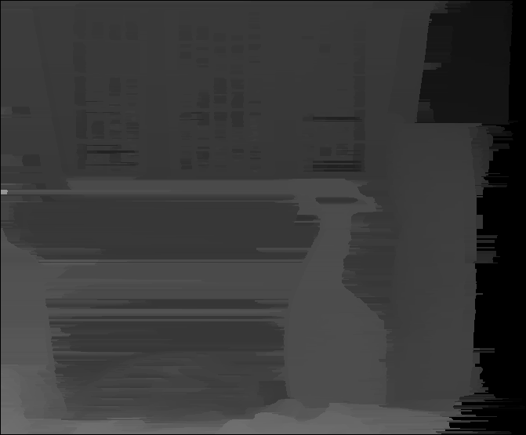

### Point cloud

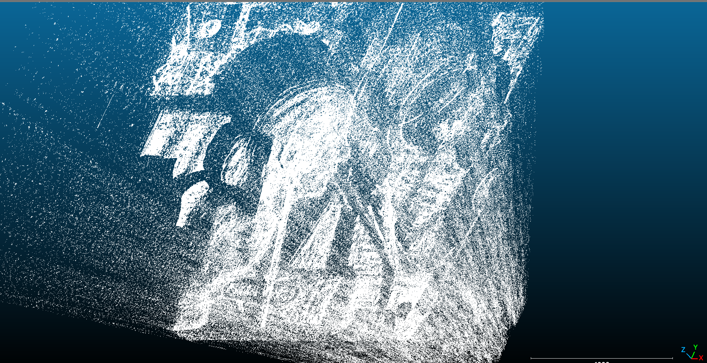

# Homework 2 - Data fusion & Point cloud

- Algorithms
  - Bilateral filter
  - Joint bilateral filter
  - Iterative upsampling algorithm
  - Tool to convert the upsampled depth or disparity to a point cloud
- Evaluation
  - 12 pairs of half-sized images have been taken from the 2006 Stereo Dataset and tested with multiple variations of parameters (spatial sigma and spectral sigma)
    - Processing time
    - Quality (JBU and iterative upsampling) on
      - SSD
      - RMSE
      - PSNR
      - SSIM
    - Created tables of the results and comparisons of the output with the ground truth
    - Found best spatial sigma and spectral sigma for each metric
- Documentation

What I have `not done`:

- Algorithms or tools
  - Oriented point cloud
  - GUI 
- Evaluation
  - Plots

## Visual outcome

The visual outcome will have 2 of the 12 pairs displaying the following:

- best result found for the 4 metrics
- upsampling result

### Bowling

- Right: Spatial sigma 3 & Spectral sigma 1
- Left: Spatial sigma 3 & Spectral sigma 3

  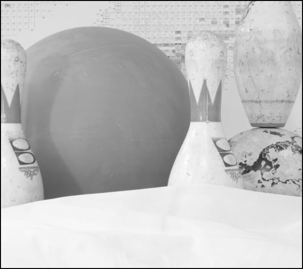
   

Upsampled image

  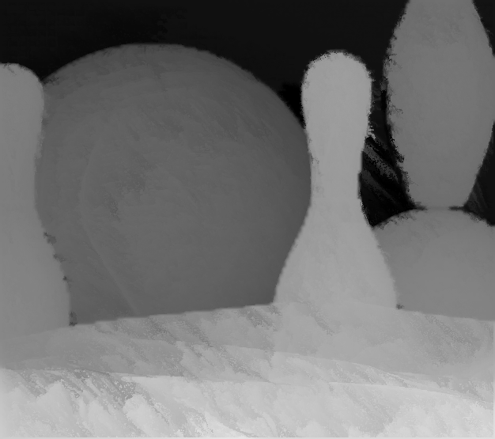

| Metric | Spatial sigma | Spectral Sigma |
|:------:|:-------------:|:--------------:|
|   SSD  |       3       |        1       |
|  RMSE  |       3       |        1       |
|  PSNR  |       3       |        1       |
|  SSIM  |       3       |        3       |
| RT (s) |       3       |        1       |

### Baby1

- Right: Spatial sigma 3 & Spectral sigma 1
- Left: Spatial sigma 0.1 & Spectral sigma 10

  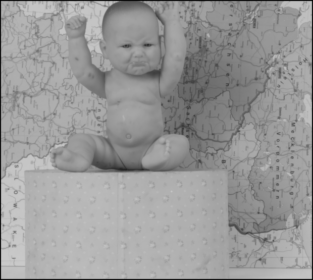
  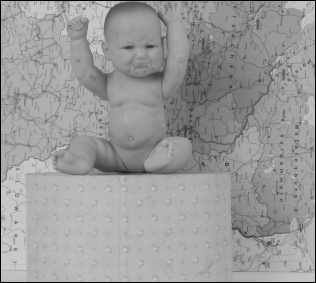 

Upsampled image

  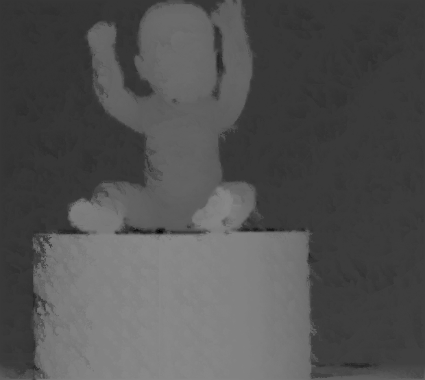

| Metric | Spatial sigma | Spectral Sigma |
|:------:|:-------------:|:--------------:|
|   SSD  |       3       |        1       |
|  RMSE  |       3       |        1       |
|  PSNR  |       3       |        1       |
|  SSIM  |      0.1      |       10       |
| RT (s) |      0.1      |       10       |

# Homework 3 - ICP

- Algorithms
  - Nearest-neighbor search using kd-trees
  - ICP algorithm
- Evaluation
  - Used 3 pairs of point clouds that are part of scans. The pairs were taken with a difference of 30deg.
  - Applied rotations of 0, 5, 10 and 20 deg.
  - Noise levels of 0, 10%, 20%
- Documentation

What I have `not done`:

- Algorithms or tools
  - Tr-ICP

## Visual outcome

The visual outcome will be composed by the pair's outputs of point clouds.

### Armadillo

  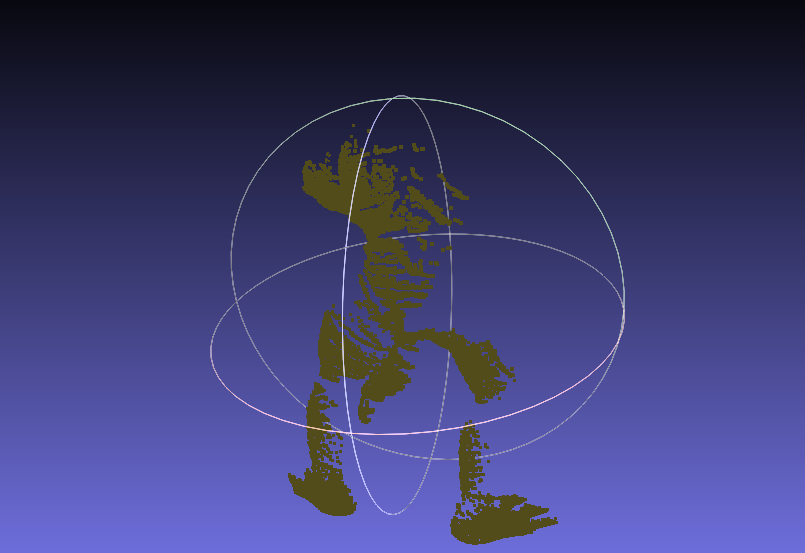

### Dragon

  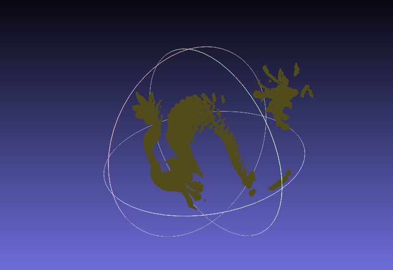

### Drill

  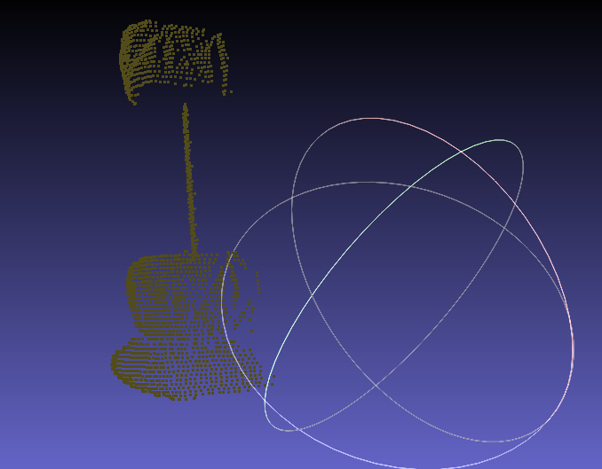

