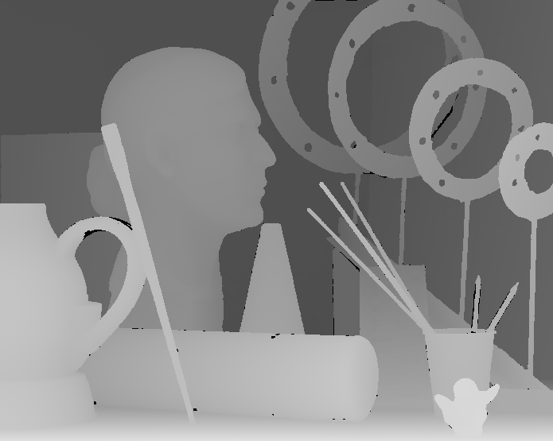
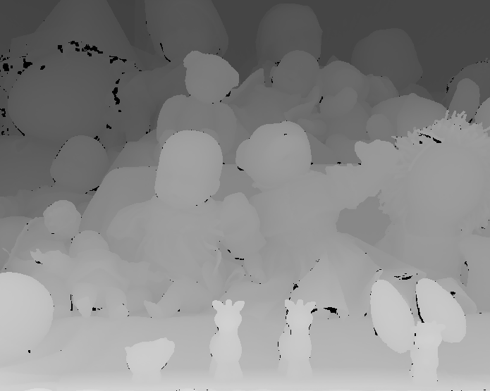
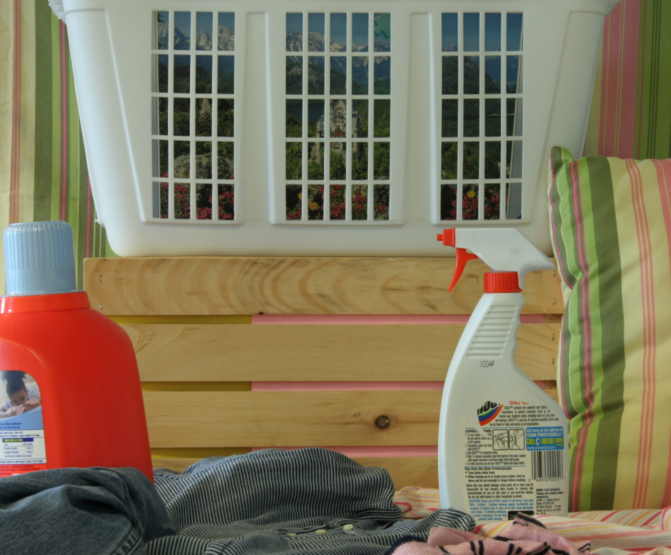

# 3D Sensing & Sensor Fusion - Homework 1

All the code can be found on GitHub at [cristisulighetean/3d_sensing_course_elte](https://github.com/cristisulighetean/3d_sensing_course_elte)

Note: the repo will became public after the deadline

## Subtask 1: Algorithm

### Naive approach

The naive approach was part of the first homework. The concep was fairly easy to grasp so that we will further build on it for the dyanamic approach.

```cpp
cv::Mat StereoCompute::getStereoNaive()
{
    cv::Mat naive_disp = cv::Mat::zeros(height, width, CV_8UC1);

    int half_window_size = params.window_size / 2;
    int progress = 0;
  
#pragma omp parallel for

    for (int i = half_window_size; i < height - half_window_size; ++i) 
    {
    
#pragma omp critical
    {
        ++progress;
        std::cout
            << "Calculating disparities for the naive approach... "
            << std::ceil(((progress) / static_cast<double>(height - params.window_size + 1)) * 100) << "%\r"
            << std::flush;
      }
        for (int j = half_window_size; j < width - half_window_size; ++j) 
        {
            int min_ssd = INT_MAX;
            int disparity = 0;

            for (int d = -j + half_window_size; d < width - j - half_window_size; ++d) 
            {
                int ssd = 0;
                for (int v = -half_window_size; v <= half_window_size; ++v) {
                    for (int u = -half_window_size; u <= half_window_size; ++u) {

                        int pixel_1 = image1.at<uchar>(i + v, j + u);
                        int pixel_2 = image2.at<uchar>(i + v, j + u + d);

                        ssd += (pixel_1-pixel_2)*(pixel_1-pixel_2);
                    }
                }

                if (ssd < min_ssd) {
                    min_ssd = ssd;
                    disparity = d;
                }
            }
            naive_disp.at<uchar>(i - half_window_size, j - half_window_size) = std::abs(disparity);
        }
    }
    std::cout << "Calculating disparities for the naive approach... Done.\r" << std::flush;
    std::cout << std::endl;

    return naive_disp;
}
```

#### Dynamic approach

Building upon the knowledge gathered from the naive approach, and the lecture support about the dynamic approach, I was able to put together the dynamic mode of computing the disparities.

The function is part of the StereoCompute class

```cpp
cv::Mat StereoCompute::getStereoDynamic()
{
    int half_window_size = params.window_size / 2;
    int progress = 0;

    cv::Mat dynamic_disp = cv::Mat::zeros(height, width, CV_8UC1);

#pragma omp parallel for

    // for each row (scanline)
    for (int y_0 = half_window_size; y_0 < height - half_window_size; ++y_0) {  

#pragma omp critical
        {
            ++progress;
            std::cout
                << "Calculating disparities for the DP approach... "
                << std::ceil(((progress) / static_cast<double>(height - params.window_size + 1)) * 100) << "%\r"
                << std::flush;
        }

        //dissimilarity (i,j) for each (i,j)
        cv::Mat dissim = cv::Mat::zeros(width, width, CV_32FC1);
        for (int i = half_window_size; i < width - half_window_size; ++i) { // left image
            for (int j = half_window_size; j < width - half_window_size; ++j) { // right image                                         
                float sum = 0;
                for (int u = -half_window_size; u <= half_window_size; ++u) {    
                    for (int v = -half_window_size; v <= half_window_size; ++v) {    
                        // Calculating the difference btw the pixels
                        float i1 = image1.at<uchar>(y_0 + v, i + u);
                        float i2 = image2.at<uchar>(y_0 + v, j + u);
                        float diff = (i1 - i2);

                        sum += std::abs(diff);                  

                    }
                }
                dissim.at<float>(i, j) = sum;
            }
        }

        cv::Mat C = cv::Mat::zeros(width, width, CV_32FC1);                                                                
        cv::Mat M = cv::Mat::zeros(width, width, CV_8UC1);    
        
        for (int i = 0; i < width; ++i) {
            M.at<uchar>(0, i) = 2;
        }
        
        for (int i = 0; i < width; ++i) {
            M.at<uchar>(i, 0) = 1;
        }
        
        for (int i = 1; i < width; ++i) {
            for (int j = 1; j < width; ++j) {

                float min = FLT_MAX;
                int index = 0;
                float C_eval[3];


                C_eval[0] = C.at<float>(i - 1, j - 1) + dissim.at<float>(i, j);
                C_eval[2] = C.at<float>(i, j - 1) + params.lambda;
                C_eval[1] = C.at<float>(i - 1, j) + params.lambda;

                for (int n = 0; n < 3; ++n) {
                    if (C_eval[n] < min) {
                        min = C_eval[n];
                        index = n;
                    }
                }

                C.at<float>(i, j) = min;
                M.at<uchar>(i, j) = index;
            }
        }
        
        int i = width - half_window_size;
        int j = width - half_window_size;
        
        cv::Mat path = cv::Mat::zeros(2 * width, 2, CV_32SC1);

        int counter = 0;

        while (i > half_window_size && j > half_window_size) {
            int val = M.at<uchar>(i, j);

            int disp = 4*std::abs(j - i);
            if (disp > 255) {
                disp = 255;
            }

            path.at<int>(counter, 0) = i;
            path.at<int>(counter, 1) = j;
          
            counter++;

            // match
            if (val == 0) {                
                --i;
                --j;
                dynamic_disp.at<uchar>(y_0, j) = disp;
            }

            // left occlusion
            else if (val==1) {      
                i--;
            }

            // Right occlusion
            else if (val == 2) {
                j--;
                dynamic_disp.at<uchar>(y_0, j) = dynamic_disp.at<uchar>(y_0, j + 1);
            }  
        }
        counter--;
        
        for (int i = counter; i > 0; i--) {
            int x = path.at<int>(i, 0);
            int y = path.at<int>(i, 1);

            if (M.at<uchar>(x, y) == 1) {
               
                dynamic_disp.at<uchar>(y_0, y) = dynamic_disp.at<uchar>(y_0, y-1);               
            }       
        }
    }

    return dynamic_disp;
}
```

### Tunable parameters

As I tried to wrap the algorithms in a class, I also hadled multiple modes of the program so that it will be easy to test and validate the results. The following snippet is the `HELP_STRING` that covers the available modes.

```cpp
#define USAGE_STRING "How to use it:\n\
  Basic Naive:\t./prog -nv image1 image2 output_name window_size dmin\n\
  Basic DP:\t./prog -dp image1 image2 output_name window_size dmin lambda\n\
  Both modes:\t./prog -nvdp image1 image2 output_name window_size dmin lambda\n\
  Point cloud:\t./prog -pc image1 image2 output_name window_size dmin\n"
```

## Subtask 2: 3D Display

### Point cloud

The point cloud was part of the second homework and after the computation of the naive disparities, I use the disparity map to further compute the point cloud in xyz format.


```cpp
std::stringstream StereoCompute::getPointCloud(cv::Mat disparity_matrix, std::string file_name)
{
    std::stringstream out3d;
    out3d << file_name << ".xyz";
    std::ofstream outfile(out3d.str());

    for (int i = 0; i < height - params.window_size; ++i) 
    {
        std::cout << "Reconstructing 3D point cloud from disparities... " 
        << std::ceil(((i) / static_cast<double>(height - params.window_size + 1)) * 100) << "%\r" << std::flush;
        for (int j = 0; j < width - params.window_size; ++j)
        {
            if (disparity_matrix.at<uchar>(i, j) == 0) continue;   

            const double disp = disparity_matrix.at<uchar>(i, j) + params.dmin;
            double u1 = j - width / 2;
            double u2 = u1 + disp;
            double v = i - height / 2;

            const double Z = params.baseline * params.focal_length / disp;
            const double X = -params.baseline * (u1 + u2) / (2 * disp);
            const double Y = params.baseline * v / disp;

            outfile << X << " " << Y << " " << Z << std::endl;
        }
  }

    std::cout << "Reconstructing 3D point cloud from disparities... Done.\r" << std::flush;
    std::cout << std::endl;

    return out3d;
}
```

## Subtask 3: Evaluation

To perform the evaluation task, I have used the 2005 Middlebury Stereo dataset with `half size` images. I took 6 cases from the dataset and performed the following tests:

- Searched for 
    - `lambda` parameters from 50 to 400
    - `window_size` parameter from 3, 5, 7
- Timed both the `naive` and `dynamic` approach

#### Books set

The output is arranged as follows: colored image, ground truth (provided by the dataset), naive approach and lastly the dynamic approach.

<p float="left">
  
   
</p>

<p float="left">
  
  
</p>

The best output of the dynamic approach had the follwing parameters:

- lambda: 200
- window_size: 5

Computation time:

- Naive: 3s
- Dynamic: 11s

#### Art set

<p float="left">
  
   
</p>

<p float="left">
  
  
</p>

The best output of the dynamic approach had the follwing parameters:

- lambda: 100
- window_size: 3

Computation time:

- Naive: 3s
- Dynamic: 5s

#### Dolls set

<p float="left">
  
   
</p>

<p float="left">
  
  
</p>

The best output of the dynamic approach had the follwing parameters:

- lambda: 50
- window_size: 3

Computation time:

- Naive: 3s
- Dynamic: 5s

#### Laundry set

<p float="left">
  
   
</p>

<p float="left">
  
  
</p>

The best output of the dynamic approach had the follwing parameters:

- lambda: 100
- window_size: 3

Computation time:

- Naive: 3s
- Dynamic: 4s

#### Moebius set

<p float="left">
  
   
</p>

<p float="left">
  
  
</p>

The best output of the dynamic approach had the follwing parameters:

- lambda: 100
- window_size: 3

Computation time:

- Naive: 8s
- Dynamic: 4s

#### Reindeer set

<p float="left">
  
   
</p>

<p float="left">
  
  
</p>

The best output of the dynamic approach had the follwing parameters:

- lambda: 100
- window_size: 3

Computation time:

- Naive: 8s
- Dynamic: 11s
