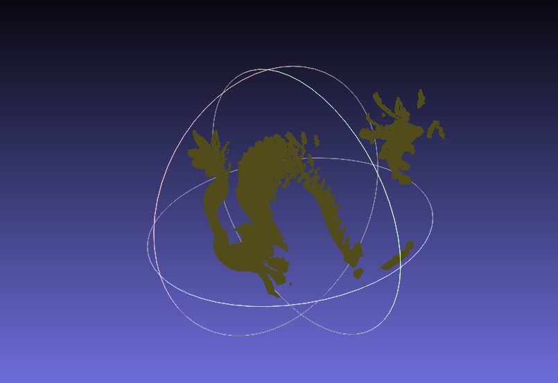
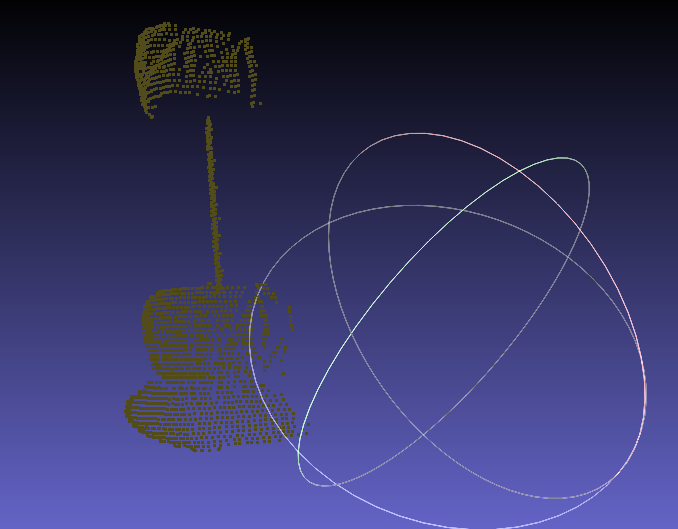
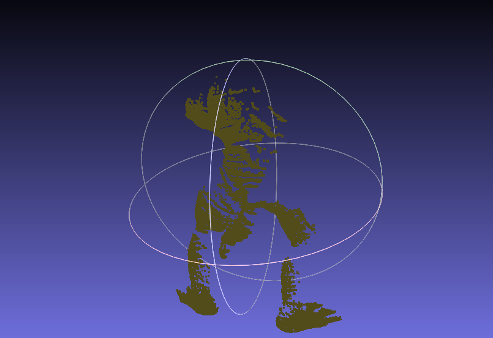

# 3D Sensing Homework 3

## ICP algorithm and Evaluation

The dataset was comprised of 3 object scans from which I took 2 pairs. The scans were taken at different angles with a maximum angle difference of 30 deg.

Only the ICP algorithm was run on the pairs. I tried different values for the rotation angle (performed on the Y axis) and gaussian noise. From the performed runs, I collected the following:
- MSE
- No. of iterations
- Runtime

### Dragon Stand

#### Variation of the rotation angle

| Rotation angle (deg) | MSE      | No. of iterations | Runtime (ms) |
|----------------------|----------|-------------------|--------------|
| 0                    | 0.010136 | 10                | 1607         |
| 5                    | 0.010923 | 9                 | 1486         |
| 10                   | 0.010792 | 9                 | 1502         |
| 15                   | 0.010639 | 9                 | 1503         |
| 45                   | 0.010568 | 10                | 1693         |

#### Variation of the gaussian noise level

| Gaussian noise level | MSE      | No. of iterations | Runtime (ms) |
|----------------------|----------|-------------------|--------------|
| 0                    | 0.010136 | 10                | 1627         |
| 10%                  | 0.086733 | 7                 | 1490         |
| 20%                  | 0.208361 | 8                 | 1638         |

#### Result of the gausian noise level being 20%

    

### Drill

#### Variation of the rotation angle

| Rotation angle (deg) | MSE      | No. of iterations | Runtime (ms) |
|----------------------|----------|-------------------|--------------|
| 0                    | 0.013844 | 1                 | 44           |
| 5                    | 0.013889 | 1                 | 45           |
| 10                   | 0.010922 | 5                 | 104          |
| 20                   | 0.013953 | 1                 | 46           |

#### Variation of the gaussian noise level

| Gaussian noise level |    MSE   | No. of iterations | Runtime (ms) |
|----------------------|----------|-------------------|--------------|
| 0                    | 0.111535 | 7                 | 146          |
| 10%                  | 0.246570 | 7                 | 148          |
| 20%                  | 0.382520 | 6                 | 126          |

#### Result of the gausian noise level being 20%

    

### Armadillo

#### Variation of the rotation angle

| Rotation angle (deg) | MSE      | No. of iterations | Runtime (ms) |
|----------------------|----------|-------------------|--------------|
| 0                    | 0.017344 | 10                | 1429         |
| 5                    | 0.010090 | 17                | 2094         |
| 10                   | 0.010476 | 14                | 1765         |
| 20                   | 0.014013 | 16                | 2063         |

#### Variation of the gaussian noise level

| Gaussian noise level | MSE      | No. of iterations | Runtime (ms) |
|----------------------|----------|-------------------|--------------|
| 0                    | 0.082568 | 9                 | 1222         |
| 10%                  | 0.200347 | 10                | 1319         |
| 20%                  | 0.335996 | 4                 | 698          |

#### Result of the gausian noise level being 20%

    

